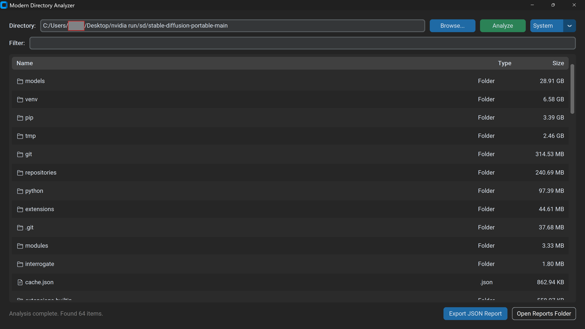
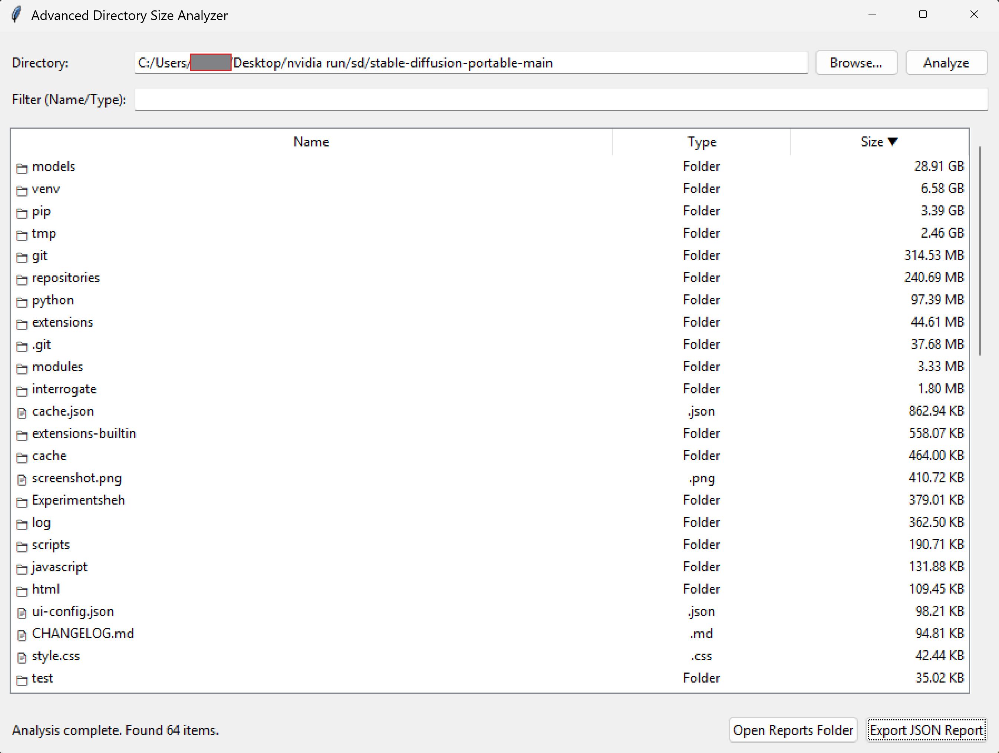

# Directory Size Analyzer

This repository contains **two versions** of a lightweight graphical utility for Windows that analyzes directory sizes. It explores files and nested folders, recursively calculating the sizes of all folders, enabling you to rapidly pinpoint what is occupying disk space.

---
## ✨ Core Features (Both Versions)
- **Deep Scanning:** Select any directory to dynamically analyze the cumulative size of all underlying files and folders seamlessly.
- **Sort & Filter:** Click on column headers (Name, Type, Size) to automatically sort your data. Utilize the real-time filter bar to search for specific file types (e.g. `mp4`, `pdf`) or specific file names.
- **Native File Explorer Integration:** Double-click any row item in the list to instantly launch its native graphical location via the Windows File Explorer. Let it be a file or a folder, it knows exactly how to handle it.
- **Quick Action Copy & Analyze:** Click the 📋 icon next to any folder to instantly copy its path to your system clipboard and organically dive into a new recursive analysis on that specific subfolder natively. Click it next to a file to simply copy its isolated path.
- **JSON Reports:** Keep a safe record of your analyzed data. One-click JSON generation accurately saves your current snapshot list to a nicely formatted JSON file located within an auto-generated `reports/` folder.

---

## 🎨 Version 1: Modern UI Variant (Recommended)
This version features a sleek UI built and has native system dark/light mode appearance transitions.



### Setting up the Modern Variant
You will need to install only one external dependency to run this variant.
1. Install `customtkinter` via pip:
```bash
pip install customtkinter
```
2. Run the modern app:
```bash
python analyze_modern.py
```

---

## ⚡ Version 2: Standard Variant (Zero Dependencies)
Purely to the Python Standard Library, this version is exactly what you need. Performs similar to the Modern variant with option to choose Dark/Light theme toggle.



### Setting up the Standard Variant
There is absolutely no `pip install` required! Just run it directly natively:
```bash
python analyze.py
```

---

